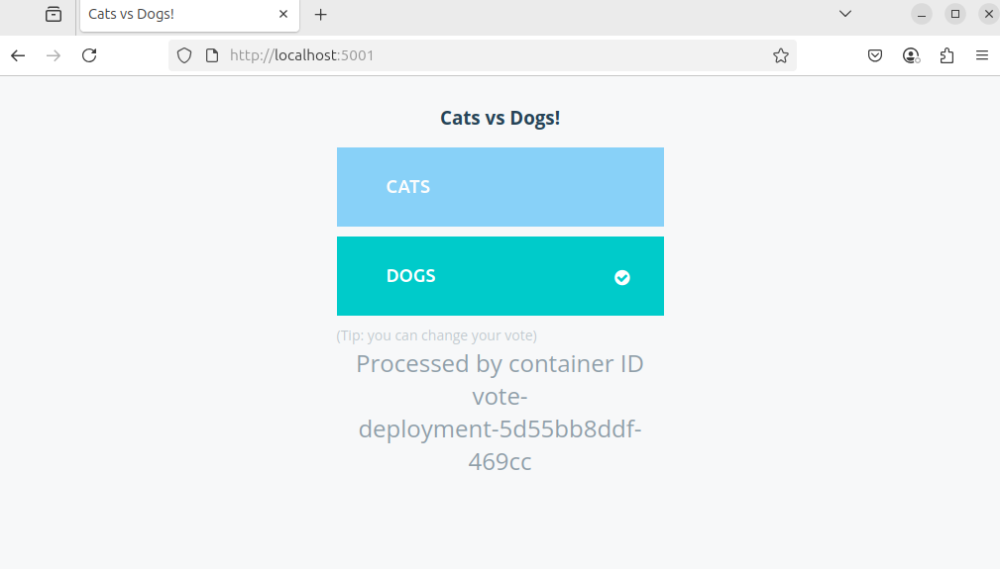
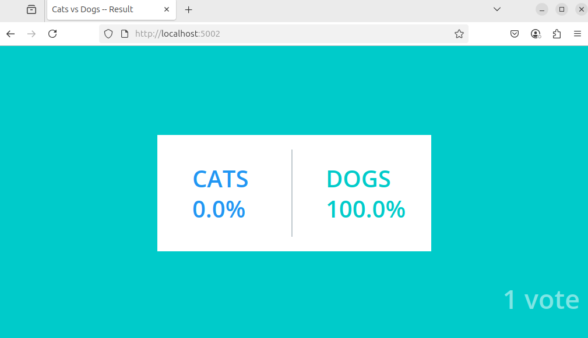

# k8s-test-jc

## Descripción General

Este repositorio contiene un manifiesto de Kubernetes (`pod-examen.yml`) que despliega una aplicación de votación compuesta por varios microservicios. El entorno está diseñado para ejecutarse en un clúster local de **k3d** (Kubernetes en Docker), facilitando pruebas y desarrollo local.

## Componentes Desplegados

El manifiesto define los siguientes recursos en el namespace `vote`:

1. **Namespace**: Crea el namespace `vote` para aislar los recursos.
2. **Vote Deployment y Service**: Despliega el frontend de votación y expone el servicio en el puerto 31000 (NodePort).
3. **Redis Deployment y Service**: Despliega una base de datos Redis para almacenar votos temporalmente.
4. **Worker Deployment**: Servicio backend que procesa los votos y los transfiere de Redis a PostgreSQL.
5. **DB Deployment y Service**: Despliega una base de datos PostgreSQL para almacenar los resultados de la votación.
6. **Result Deployment y Service**: Despliega el frontend de resultados y expone el servicio en el puerto 31001 (NodePort).

## Estructura del archivo `pod-examen.yml`

- **Namespace**: Define el espacio de nombres `vote`.
- **Deployments**: Crea los pods para cada microservicio (`vote`, `redis`, `worker`, `db`, `result`).
- **Services**: Expone los servicios necesarios, usando `NodePort` para `vote` y `result`, y `ClusterIP` para `redis` y `db`.
- **Persistencia**: Redis y PostgreSQL usan volúmenes efímeros (`emptyDir`) para almacenamiento temporal.

## Requisitos Previos

- Tener instalado [k3d](https://k3d.io/) y [kubectl](https://kubernetes.io/docs/tasks/tools/).
- Docker en funcionamiento.

## Despliegue en k3d

1. **Crear un clúster k3d (si no existe):**
   ```bash
   k3d cluster create mi-cluster
   ```
2. **Aplicar el manifiesto:**
   ```bash
   kubectl apply -f pod-examen.yml
   ```
3. **Verificar los recursos:**
   ```bash
   kubectl get all -n vote
   ```

## Acceso a la Aplicación (Port Forward)

Como k3d no expone los puertos NodePort directamente a tu máquina, debes usar port forwarding para acceder a los servicios `vote` y `result`:

- **Frontend de votación:**
  ```bash
  kubectl port-forward svc/vote-service 5001:5001 -n vote
  ```
  Accede en tu navegador a: [http://localhost:5001](http://localhost:5001)

- **Frontend de resultados:**
  ```bash
  kubectl port-forward svc/result-service 5002:5002 -n vote
  ```
  Accede en tu navegador a: [http://localhost:5002](http://localhost:5002)

## Resultados Esperados

Al desplegar correctamente la aplicación y acceder a los servicios, deberías ver las siguientes interfaces:

### Interfaz de Votación


### Interfaz de Resultados


## Autor
Proyecto desarrollado por Jose Cabrera